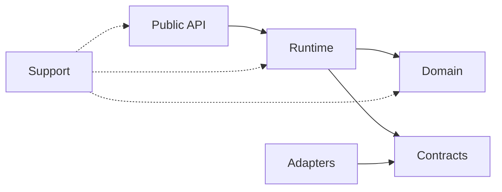

Move data through the layers in one direction. Cross every boundary with validated class instances. See [[type-safety]].

## Layers

| Layer | Responsibility |
| --- | --- |
| Public API | Receives developer requests and returns public response instances |
| Contracts | Declares abstract ports used by the runtime and domain |
| Domain | Owns entities, value objects, invariants and policies |
| Runtime | Coordinates a run, its loop, state, context, models and tools |
| Adapters | Implements contracts for providers, persistence, MCP and telemetry |
| Support | Provides test doubles, fixtures, builders and assertions |

The Public API is the equivalent of an inbound controller. Runtime is the application layer. Contracts and Adapters form the ports and adapters boundary.

## Dependency rules

- Domain imports no framework, provider, storage or container.
- Contracts import only stable domain concepts required by the port.
- Runtime depends on Domain and Contracts, never on concrete Adapters.
- Adapters depend inward and translate external failures into module errors.
- Public API converts public requests into command classes and maps runtime results into public response classes.
- Support does not ship runtime behavior.
- NestJS stays in the public composition surface and Nest adapter.
- Wirely stays in internal `*.module.ts` composition files. See [[module-boundaries]].

Mechanical code may exist at lower levels, but it stays behind a declarative service API. A feature module exports one high-level service or an abstract port needed by another module.

## What is still missing

The current package mixes NestJS, provider code, runtime coordination and domain behavior. The refactor must move each symbol to its owning layer.
