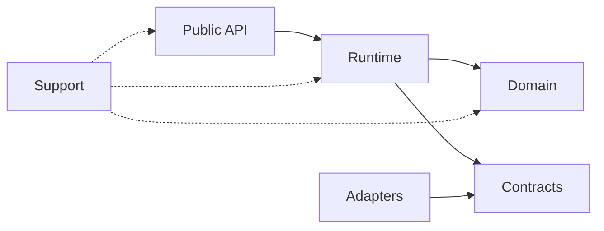

Move data through the layers in one direction. Cross every boundary with validated class instances. See [[type-safety]].

## Layers

| Layer | Responsibility |
| --- | --- |
| Public API | Receives developer requests and returns public response instances |
| Contracts | Declares abstract ports used by the runtime and domain |
| Domain | Owns entities, value objects, invariants and policies |
| Runtime | Coordinates a run, its loop, state, context, models and tools |
| Adapters | Implements contracts for providers, persistence, MCP and telemetry |
| Support | Provides test doubles, fixtures, builders and assertions |

These six are folders: they say where a symbol lives. The responsibility a class carries is the other axis, and [[layered-responsibilities]] names it: Edge, UseCase, Service, Repository. The two line up. Public API holds the Edge classes, Runtime holds the UseCase and Service classes, Contracts declares the Repository ports and Adapters implements them. Domain holds no layer at all, because a value object calls nothing.

```mermaid
flowchart LR
    API[Public API] --> Runtime
    Runtime --> Domain
    Runtime --> Contracts
    Adapters --> Contracts
    Support -.-> API
    Support -.-> Runtime
    Support -.-> Domain
```

## Dependency rules

- Domain imports no framework, provider, storage or container.
- Contracts import only stable domain concepts required by the port.
- Runtime depends on Domain and Contracts, never on concrete Adapters.
- Adapters depend inward and translate external failures into module errors.
- Public API converts public requests into command classes and maps runtime results into public response classes.
- Support does not ship runtime behavior.
- NestJS stays in the public composition surface and Nest adapter.
- Composition stays in `runtime/composition`, and resolves nothing from a container. See [[module-boundaries]].

Mechanical code may exist at lower levels, but it stays behind a declarative service API. A feature module exports one high-level service or an abstract port needed by another module.

## What is still missing

The folders exist and hold the right things. What is missing is inside them.

- The six folders are layer-first (`domain/session`, `runtime/session`, `adapters/storage`), so a reader looking for one concept opens three trees. The grouping by concept is a later move, and the module-first tree is a decision still open.
- The responsibilities are not separated yet inside the Runtime folder: use cases still contain loops, branches and arithmetic that belong in the services under them. That is the move [[layered-responsibilities]] describes, and it is what drops the large constructors [[component-heuristics]] flags.

Nothing asserts the dependency rules above. `packages/core/src/package-boundaries.spec.ts` walks the tree and asserts only that the core imports no sibling package; the rule that Runtime never imports an Adapter is still a review question. The same tree walk is what the category spec of [[file-categories]] reuses.
