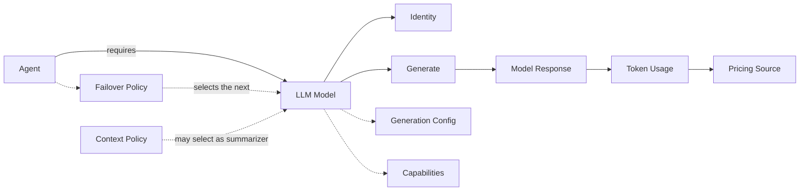

An LLM model is the required component that transforms execution context into the agent's next decision.

Every resolved agent has exactly one primary model. The agent may declare it directly or inherit it from the environment, but it is never absent after resolution.

## Minimum contract

Every model has:

- **Identity:** uniquely identifies the provider and model used for logs, pricing and diagnostics.
- **Generation:** receives a normalized `ModelRequest` and produces an asynchronous stream of normalized `ModelResponse` values.

The asynchronous stream supports complete and incremental responses through the same contract.

## First-class features

These optional features belong to the model:

- **Generation configuration:** parameters such as temperature, token limit and stop sequences.
- **Capabilities:** supported input and output modalities, tool calling, structured output and streaming.

Resilience is not one of them. Deciding whether to attempt the same model again, or to replace it with another one, requires knowledge the model does not have: how many attempts the current request already made and which models already failed. That knowledge belongs to the run, so retry and failover are policies of the agent. See [[agent]].

Token usage is a fact reported by a model response. Cost is calculated separately by a `PricingSource` from the model identity and usage.

The model never builds prompts, executes tools, persists sessions, manages state, controls HITL or owns the agent loop. It only performs inference. The runtime invokes it and coordinates everything around it.

